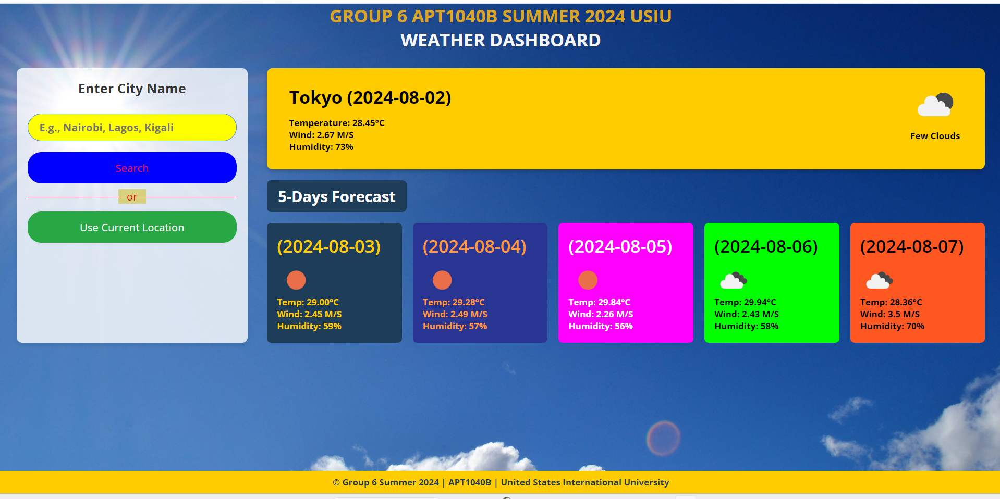

# WeatherWave Dashboard

**WeatherWave Dashboard** is a comprehensive weather application developed as part of the GROUP 6 APT1040B SUMMER 2024 project at the United States International University (USIU). This application provides real-time weather updates and a 5-day weather forecast for cities worldwide, using the OpenWeatherMap API.

## Features

- **Real-Time Weather Updates**: Get up-to-date weather information for any city.
- **5-Day Weather Forecast**: View a detailed 5-day weather forecast with temperature, wind speed, and humidity.
- **Current Location Weather**: Automatically fetch weather details for your current location using geolocation.
- **Search Functionality**: Easily search for weather details by entering the city name.

## Technologies Used

- **HTML5 & CSS3**: For structuring and styling the web pages.
- **JavaScript**: For fetching data from the OpenWeatherMap API and updating the DOM.
- **OpenWeatherMap API**: To get weather data based on city name or geolocation.
- **Google Fonts**: For custom fonts used in the application.

## How to Use

1. **Enter City Name**: Type the name of the city for which you want to see the weather details in the input box and click the "Search" button.
2. **Use Current Location**: Click the "Use Current Location" button to fetch weather details for your current location.
3. **View Weather Details**: The current weather details and a 5-day forecast will be displayed on the dashboard.

## Screenshots



## Installation

1. **Clone the repository**:
   ```sh
   git clone https://github.com/your-username/WeatherWave-Dashboard.git

## License (MIT License)
This project is licensed under the MIT License - see the LICENSE file for details. (c) Shariff Mohamed Abdi.
